# node_info
>This project is built with Node.js(0.10), database used is MySQL, only tested on Linux(Ubuntu and CentOS).

## Todo
1. Home
	
	List todo items will be done today.
	
	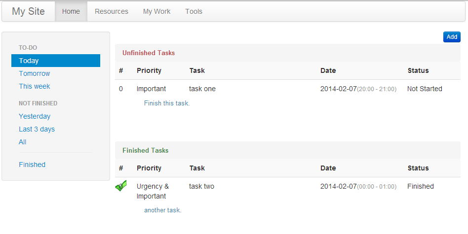
2. Add a todo item
	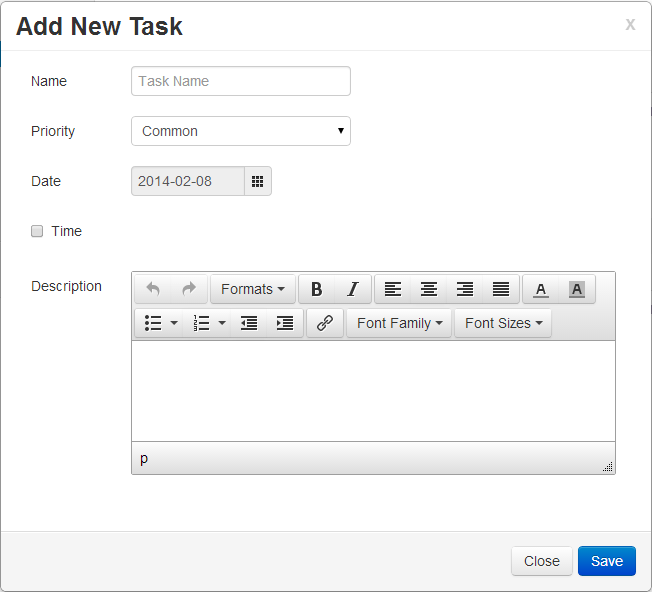
3. When hover over a todo item
	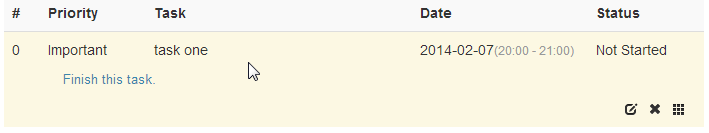
4. Double click priority field to modify priority of a certain todo item

	The same to Status field.

	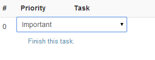
5. View all finished todos
	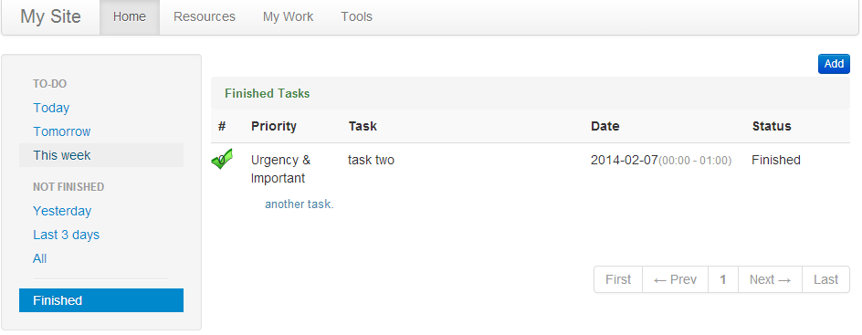
	
## Resource
1. Home
	
	List recently added items or items in a certain category.
	
	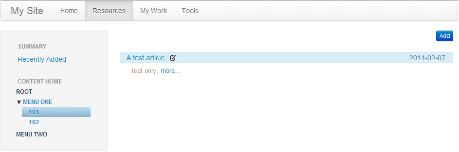
2. Hover over left navigator to modify categories

	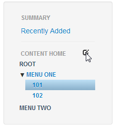
	
3. Edit categories
	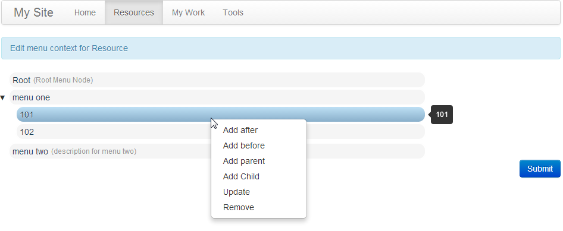
4. View certain resource item detail
	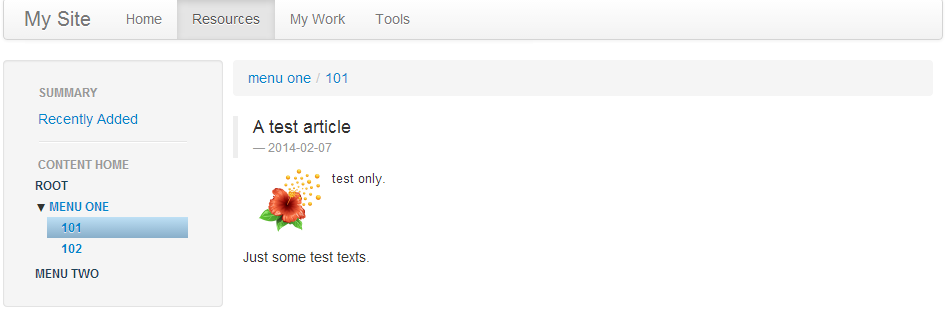
5. Edit a resource item
	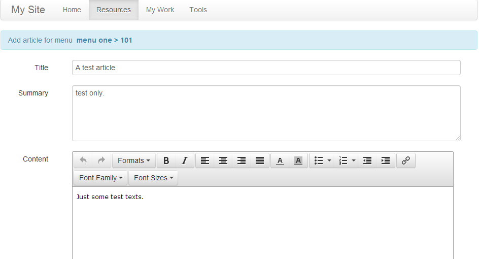
	
## Work Done

This is used to record work which are done, grouped by date, so we can easily to find what has been done at a certain day.

1. Home
	
	Note that the bug id in title is linkable.
	
	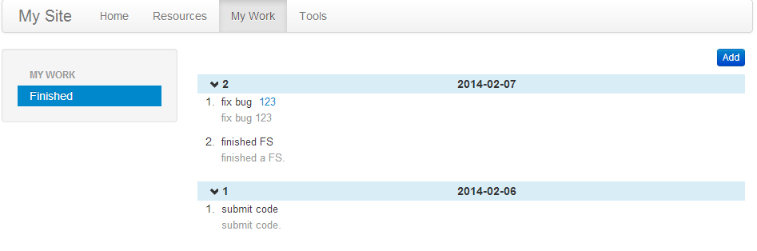
2. Edit a work done item
	
	Note that "mybug(123)" in title field, this will be shown as a link on home page.
	
	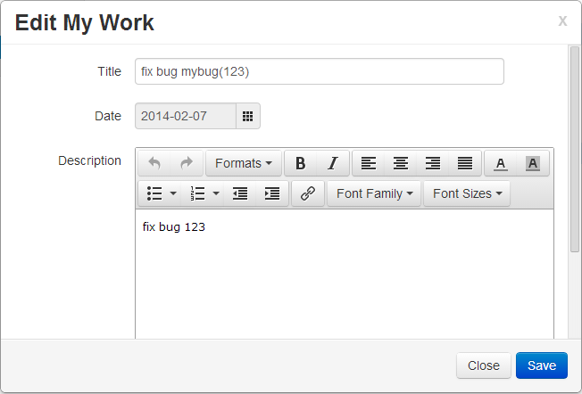
	
## Tool
### Tool - HTML page

We can write some HTML pages for simple functions, e.g. list color set, or use javascript to supply some funny applications.

1. Home
	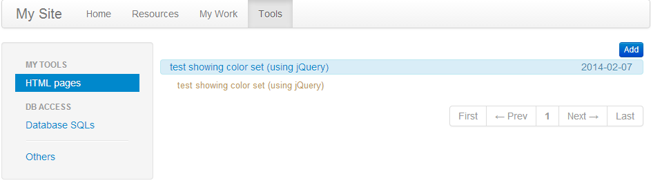
2. Add a HTML page
	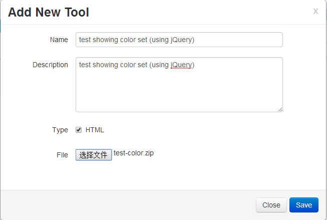
3. View Result

	Click the title from home to view result.

	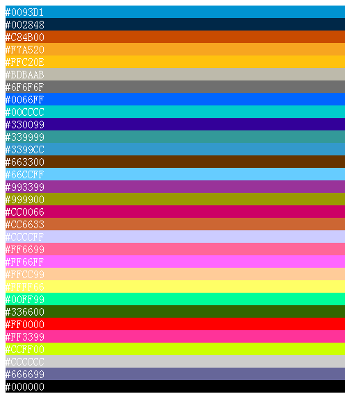

### Tool - DB sql

This is designed to store SQLs which are used frequently, and support adding custom parameters in sql sentence, these parameters will be shown as HTML widget on page.

1. Home
	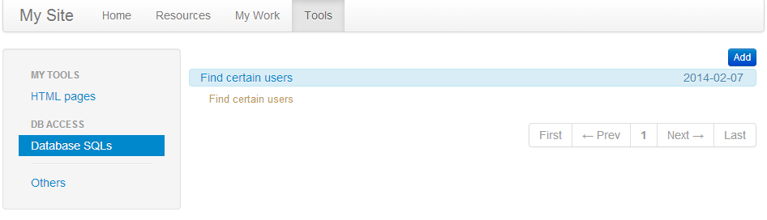
2. Edit DB sql

	Note those characters like "{{Name}}"	in SQL Content field, these will be parsed as parameters.

	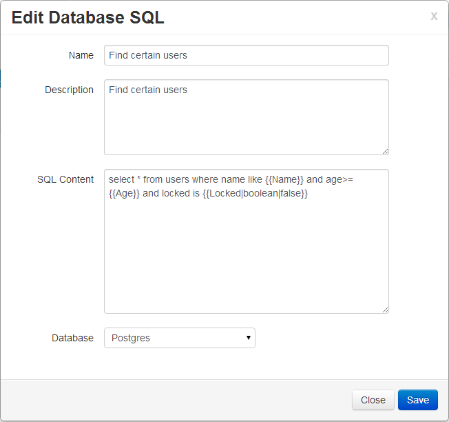
3. DB sql running page

	You must supply DB connection criteria, they will be stored in a session.

	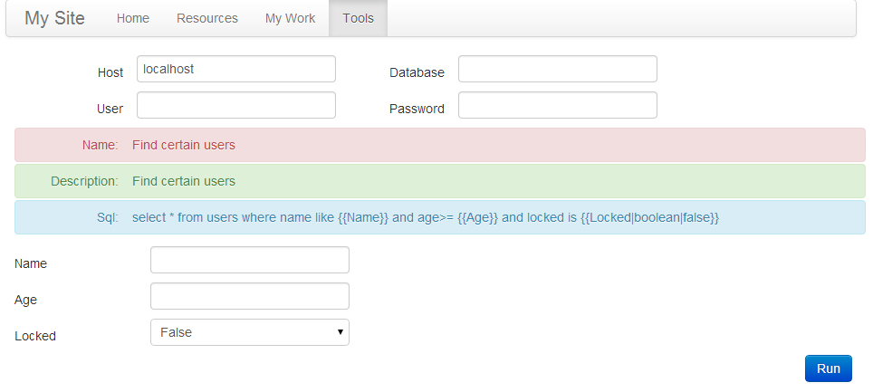